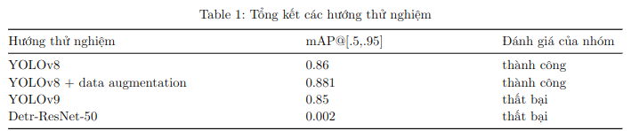

# Image Processing: Sino-Nom character localization

## Introduction

This project aims to localize Sino-Nom characters in images using image processing techniques and the YOLO (You Only Look Once) algorithm.

## Description

The project is structured as follows:

- `data.yaml`: Contains the configuration for the dataset.
- `datasets`: Contains the images and labels for training and validation.
- `utils/augmentation/run.py`: The main script to augment the dataset.
- `utils`: Contains utility scripts for data augmentation and dataset handling.
- `yolo_baseline.py`: Code to run YOLO baseline, no improvement to generate a baseline to compare between approaches
- `yolov8.py`: Code to train YOLO v8 (final code of us) 
- `run_v9.sh`: The script to train YOLO v9 model

## Project structure

```
.
├── datasets
│   ├── images
│   └── labels
├── data.yaml
├── eval.py
├── infer.py
├── notebooks
│   ├── augmentation.ipynb
│   ├── nom-localization.ipynb
│   └── not-gonna-make-it.ipynb
├── __pycache__
│   └── utils.cpython-311.pyc
├── README.md
├── report.pdf
├── requirements.txt
├── run_augmentation.py
├── run_v9.sh
├── train
│   ├── args.yaml
│   ├── events.out.tfevents.1716308857.1e76c7ee4f5d.2455.0
│   ├── labels_correlogram.jpg
│   ├── labels.jpg
│   ├── results.csv
│   ├── train_batch0.jpg
│   ├── train_batch1.jpg
│   ├── train_batch2.jpg
│   └── weights
├── train2
│   ├── args.yaml
│   ├── confusion_matrix_normalized.png
│   ├── confusion_matrix.png
│   ├── events.out.tfevents.1716346557.0959ac39d9d8.5625.0
│   ├── F1_curve.png
│   ├── labels_correlogram.jpg
│   ├── labels.jpg
│   ├── P_curve.png
│   ├── PR_curve.png
│   ├── R_curve.png
│   ├── results.csv
│   ├── results.png
│   ├── train_batch0.jpg
│   ├── train_batch1.jpg
│   ├── train_batch2480.jpg
│   ├── train_batch2481.jpg
│   ├── train_batch2482.jpg
│   ├── train_batch2.jpg
│   ├── val_batch0_labels.jpg
│   ├── val_batch0_pred.jpg
│   ├── val_batch1_labels.jpg
│   ├── val_batch1_pred.jpg
│   └── weights
├── training.yaml
├── utils
│   ├── augmentation
│   ├── dataset.py
│   ├── __init__.py
│   └── __pycache__
├── yolo_baseline.py
└── yolov8.py
```

## Result



## Reproduce

To reproduce the results, follow these steps:

1. Clone the repository.
2. Install the necessary dependencies: `pip install -r requirements.txt`.
3. Get out data from <a href="https://www.kaggle.com/datasets/ngolehoang/sinom-augment-data">Augment-Data </a> or you can make own dataset and put data to the right folder.
4. If you want to train from scratch run `sh run_v9.sh` or else you can use our code to finetune YOLO model
   1. Get a pretrained model weights from anywhere you can get from ""
   2. Run `python yolov8.py`
## Authors
This repository was made by my team consist of 4 members:
[Luu Van Duc Thieu](https://github.com/echodrift)
[Ngo Le Hoang](https://github.com/armistcxy)
[Nguyen Thanh Phat](https://github.com/aqu4holic)
[Le Hong Duc](https://github.com/tedomi2705)

## License
[MIT](https://choosealicense.com/licenses/mit/)

